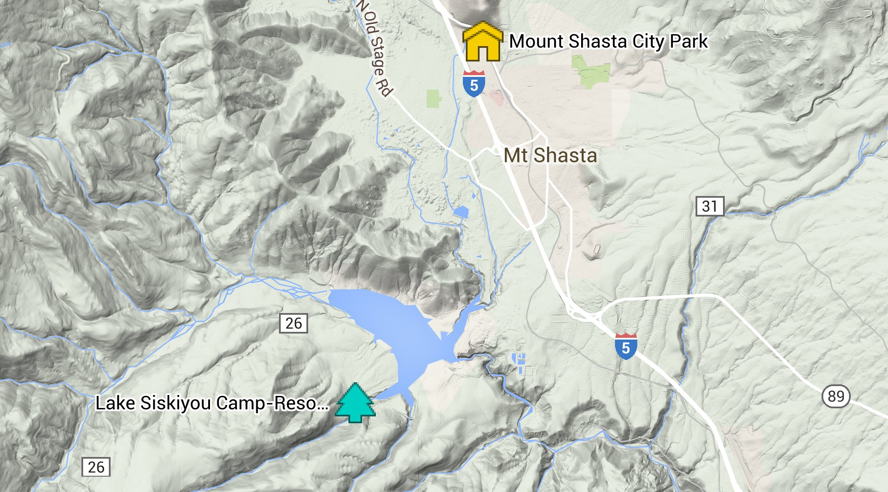

# Schedule for Kelly & Pete’s Wedding Celebration <small>September 11, 12, and 13, 2015</small>

Thank you for joining us for our celebration! We hope you have a great weekend!

Many thanks to our parents, Joanne and Alan Brady and Cathy and Guy Gadomski, for their help and support, both this weekend and all of our lives!

Love,  
Kelly and Pete

530.440.4630 (Pete)  
530.227.4099 (Kelly)

## Thursday, September 10

**1:00pm on:** Group campsite G1 at Lake Siskiyou campground available for check in. Check in at the front gate, cost is $5 per person and $5 per car. Set up your stuff anywhere that seems appropriate within site G1.

## Friday, September 11

**All day:** Group campsite G1 at Lake Siskiyou campground available for check in. Check in at the front gate, cost is $5 per person and $5 per car. Set up your stuff anywhere that seems appropriate within site G1.

**1:00pm on:** McCloud Mountain Bluegrass Festival at the Hoo Hoo park in McCloud, CA. Free.

**5:00pm to 6:00pm:** Lawn games and drinks outside of the Dance Hall at the Mount Shasta City Park.

**6:00pm to 8:00pm:** Dinner at the Dance Hall at the Mount Shasta City Park. All are invited.

**8:00pm on:** Campfire, music, and revelry at the Lake Siskiyou group campsite G1. Quiet time is 10:00pm, so please respect those around us and keep the noise to a minimum after that time.

## Saturday, September 12 <small>note: different than our previous email</small>

**12:00pm on:** McCloud Mountain Bluegrass Festival at the Hoo Hoo park in McCloud, CA for those looking for something to do. Small cover charge. http://mccloudmountainbluegrass.com/

**5:00pm to 6:00pm:** Ceremony, drinks, and lawn games outside the dance hall at Mount Shasta City Park.

**6:00pm to (roughly) midnight:** Dinner, dancing, and celebration.

**11:00pm to 12:30am:** Shuttle (one 14-passenger van) running between the dance hall and the campground.

## Sunday, September 13

**8:00am to 11:00am:** Pancake breakfast at the Lake Siskiyou campground.

## Locations

  

### Mount Shasta City Park  
<address>
1315 Nixon Rd, Mt Shasta, CA 96067
</address>

The dance hall is located in the city park.

### Lake Siskiyou Camp-Resort  
<address>
4239 W. A. Barr Rd, Mt Shasta City, CA  
530.926.2610
</address>

Group site G1, reservation under “Brady”.

$5 per person, $5 per car.
