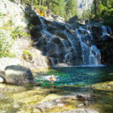
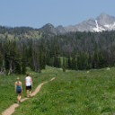
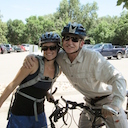
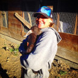

Kelly Brady and Pete Gadomski are getting married on September 12th, 2015.
The wedding will be at [The Bar 717 Ranch](http://www.bar717.com/) in Trinity County, California.
We hope that you'll join us for a weekend of celebration and community!

"Formal" invitations will be sent out in 2015.
Please [send us an email](mailto:bradygadomski@gmail.com) if you have any questions before then.

We can't wait to see you in September!

  
  

    
The Bar 717 Ranch in the Spring.

  

# The Location

The Bar 717 Ranch is located between Hayfork and Hyampom, California, nestled into the steep hills and valleys of Trinity County.
During the summer, the ranch is the site of Camp Trinity, a coeducational summer camp for kids aged eight to seventeen; Kelly and Pete met when they were both counselors at the camp.
You can find out more about the camp's history [on their website](http://www.bar717.com/history/).

## Getting There

The Bar 717 Ranch is located about two hours west of Redding, California, and is generally assessable only by private vehicle, no shuttles or buses are available.
[See where the camp is on Google Maps](https://www.google.com/maps/place/Bar+717+Ranch/@40.6205833,-123.3770636,15z/data=!4m2!3m1!1s0x54d3bd20c45d22b5:0x636ee857e506bb94).
The Bar 717 website also has some [hand written directions](http://www.bar717.com/about-us/location/) to the ranch.

If you are looking to fly in from around the country, [Redding](http://www.ci.redding.ca.us/transeng/airports/index.htm) and [Eureka/Arcata](https://plus.google.com/100151413109057686697/about?gl=us&hl=en) are both about two hours from camp.
[Sacramento](http://www.sacramento.aero/smf/) is only about four hours from camp, and [San Francisco](http://www.flysfo.com/) is the closest large airport.
[Portland](http://www.portofportland.com/PDX_Home.aspx) is another option.

We want to do our best to help people get to our celebration, so if you are willing to provide a carpool or need a ride, please [email us](mailto:bradygadomski@gmail.com).

## Accommodations

In general, life on the Bar 717 Ranch can best be described as "rustic", but we will have a wide variety of lodging options available to our guests, including accessible rooms.
The camp's website has [descriptions](http://www.bar717.com/about-us/facilities/) of many available options &mdash; many guests will be staying on sleepting platforms.
Some guests will also be camping out on the camp property, which could be a fun and affordable option and a great way to get to experience the beautiful area!

Lodging reservations will begin when official invitations are sent out, and will be made through Pete and Kelly.

# The Schedule

We encourage you to set aside some extra time to explore beautiful Northern California.
The weekend's rough schedule will look like this:

- **Friday, September 11th**: 
  - Sit-down dinner in the evening, all invited guests are welcome
  - Open mike night after dinner, including a campfire
- **Saturday, September 12th**:
  - Festivities will begin in the late afternoon

As you can see, we're leaving things open -- we hope you can join us for our celebration and any other adventures that come up throughout the weekend!

  
  

    
And yes, there will be dancing.

  

## Meals

As a part of the wedding, we will be providing meals at the ranch starting with dinner on Friday and running through Sunday morning breakfast.
There are also restaurants in Hyampom and Hayfork, both of which are about thirty minutes away from the ranch.

# Things to Do

While we don't have a ton of scheduled activities for the weekend, there will be plenty going on at the ranch and in the surrounding area.
We encourage you to get out and explore the area as much as you can!
We will do our best to connect people who are looking to do similar activities, and will provide detailed information about some of our favorite spots.

Here's a couple of ideas to inspire you:

  <h4 class="media-heading">The River</h4>
  

    A tried and true standby of every counselor on her day off, chilling by the river is a great way to while away the day.
    Hayfork Creek runs right through the ranch, and the [South Fork of the Trinity](http://en.wikipedia.org/wiki/South_Fork_Trinity_River) is just a short drive away.
    You can be sure people will be headed to the river every day.
  

  <h4 class="media-heading">Hiking</h4>
  

    The ranch itself has miles of trails that can keep you occupied for days, or even a whole summer.
    The nearby [Trinity Alps](http://en.wikipedia.org/wiki/Trinity_Alps) provide wonderful granite terrain for day hikes or multi-day adventures.
  

  <h4 class="media-heading">Biking</h4>
  

    If you're able to get a bike to the ranch, there's miles of forest service roads, trails, and paved roads for you to explore.
  

  <h4 class="media-heading">Just Relax</h4>
  

    And of course, there's going to be plenty of time to kick back, open a beverege, and catch up with friends and family.
    Maybe a goat, too.
  

# We can't wait!

We are looking forward to seeing all of you in September 2015 for our big party!
