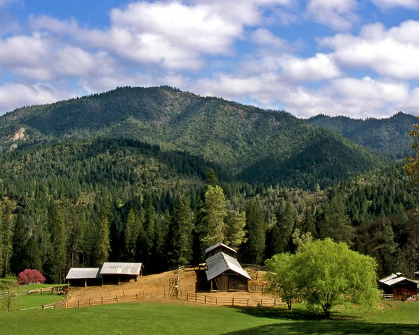
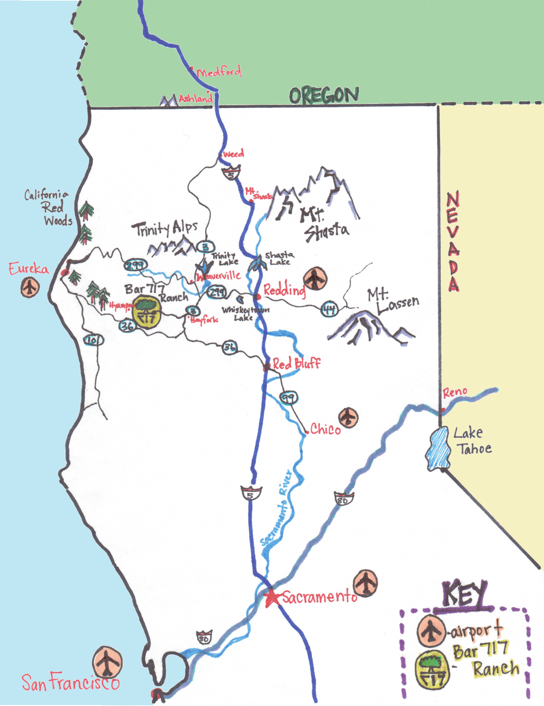

Kelly Brady and Pete Gadomski are getting married on September 5th, 2015.
The wedding will be at [The Bar 717 Ranch](http://www.bar717.com/) in Trinity County, California.
We hope that you'll join us for a weekend of celebration and community!

"Formal" invitations will be sent out in 2015.
Please [send us an email](mailto:kp@bradygadomski.com) if you have any questions before then.

We can't wait to see you in September!

  
  

    
The Bar 717 Ranch in the Spring.

  

# The Location

The Bar 717 Ranch is located between Hayfork and Hyampom, California, nestled into the steep hills and valleys of Trinity County.
During the summer, the ranch is the site of Camp Trinity, a coeducational summer camp for kids aged eight to seventeen; Kelly and Pete met when they were both counselors at the camp.
You can find out more about the camp's history [on their website](http://www.bar717.com/history/).

## Getting There

The Bar 717 Ranch is located about two hours west of Redding, California, and is generally assessable only by private vehicle, no shuttles or buses are available.
[See where the camp is on Google Maps](https://www.google.com/maps/place/Bar+717+Ranch/@40.6205833,-123.3770636,15z/data=!4m2!3m1!1s0x54d3bd20c45d22b5:0x636ee857e506bb94).
The Bar 717 website also has some [hand written directions](http://www.bar717.com/about-us/location/) to the ranch.

If you are looking to fly in from around the country, [Redding](http://www.ci.redding.ca.us/transeng/airports/index.htm) and [Eureka/Arcata](https://plus.google.com/100151413109057686697/about?gl=us&hl=en) are both about two hours from camp.
[Sacramento](http://www.sacramento.aero/smf/) is only about four hours from camp, and [San Francisco](http://www.flysfo.com/) is the closest large airport.

We want to do our best to help people get to our celebration, so if you are willing to provide a carpool or need a ride, please [email us](mailto:kp@bradygadomski.com)

## Accommodations

In general, life on the Bar 717 Ranch can best be described as "rustic", but we will have a wide variety of lodging options available to our guests, including handicap-accessible rooms.
Many of our guests will also be camping out, which could be a fun and affordable option and a great way to get to experience the beautiful area!

Lodging reservations will begin when official invitations are sent out, and will be made through Pete and Kelly.

# The Schedule

We are having our big party, a.k.a. the wedding, over Labor Day weekend, and we encourage you to set aside some extra time to explore beautiful Northern California.
The weekend's rough schedule will look like this:

- **Friday, September 4th**: 
  - Sit-down breakfast
  - Sack lunches
  - Sit-down dinner in the evening, all invited guests are welcome
  - Open mike night after dinner, including a campfire
- **Saturday, September 5th**:
  - Sit-down breakfast
  - Sack lunches
  - Festivities will begin in the late afternoon
- **Sunday, September 6th**:
  - Sit-down breakfast

As you can see, we're leaving things open -- we hope you can join us for our celebration and any other adventures that come up throughout the weekend!

  
  

    
And yes, there will be dancing.

  

# Things to Do

While we don't have a ton of scheduled activities for the weekend, there will be plenty going on at the ranch and in the surrounding area.
We encourage you to get out and explore the area as much as you can!
We will do our best to connect people who are looking to do similar activities, and will provide detailed information about some of our favorite spots.

Here's a couple of idea to inspire you:

