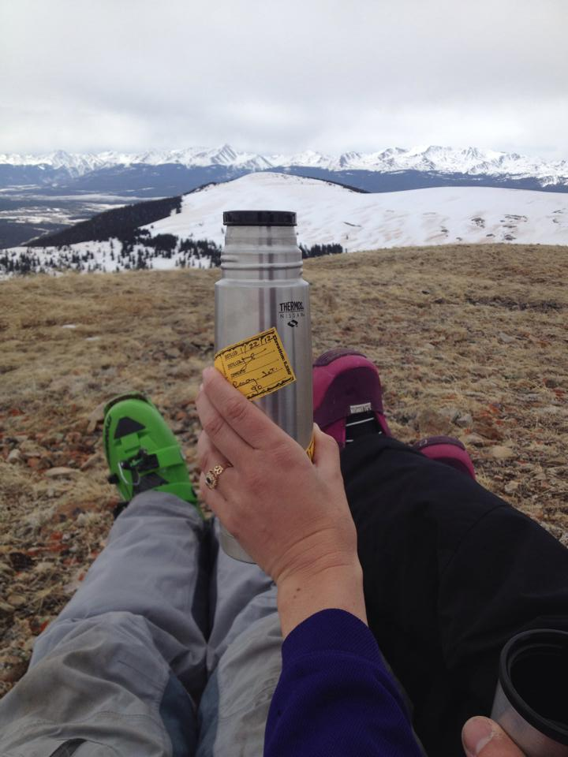

# The Wedding

Kelly Brady and Pete Gadomski are getting married on September 5th, 2015.
The wedding will be at [The Bar 717 Ranch](http://www.bar717.com/) in Trinity County, California.

  
  

    
The Bar 717 Ranch in the Spring.

  

We hope that you'll join us for a weekend of fun and community!
Invitations and more information about the wedding itself will be sent in 2015.

Fusce feugiat pede vel quam. In et augue.

Lorem ipsum dolor sit amet, consectetuer adipiscing elit.

Phasellus mollis dictum nulla. Integer vitae neque vitae eros fringilla rutrum.
Vestibulum in pede adipiscing mi dapibus condimentum. Etiam felis risus,
condimentum in, malesuada eget, pretium ut, sapien. Suspendisse placerat lectus
venenatis lorem. Sed accumsan aliquam enim. Etiam hendrerit, metus eu semper
rutrum, nisl elit pharetra purus, non interdum nibh enim eget augue. Sed
mauris. Nam varius odio a sapien. Aenean rutrum dictum sapien. Fusce pharetra
elementum ligula. Nunc eu mi non augue iaculis facilisis. Morbi interdum. Donec
nisi arcu, rhoncus ac, vestibulum ut, pellentesque nec, risus. 

# About Us

Kelly and Pete met in 2010 while working as counselors for Camp Trinity on the Bar 717 Ranch.
They got engaged in 2014 on a mountain near Leadville, Colorado.

  
  

    Engagement
  

# The Location

The Bar 717 Ranch is located in Trinity County, California, about two hours west of Redding.

