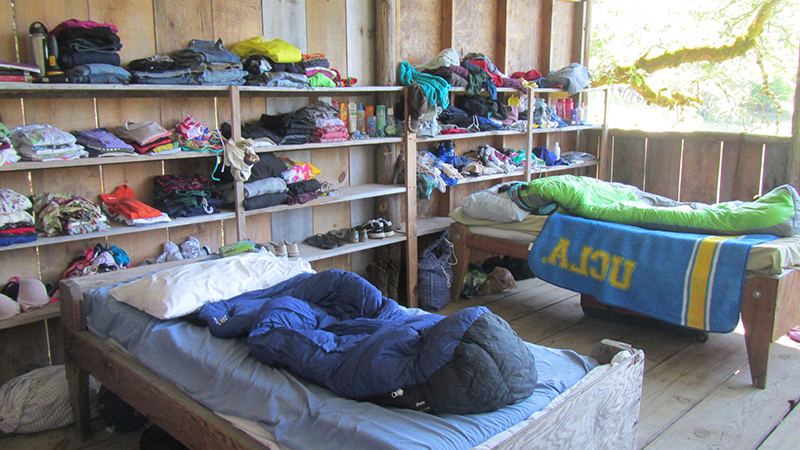

Due to fires near the Bar 717 Ranch, <strong>we have changed the location of our celebration to Mount Shasta, California.
The dates have not changed.</strong>
Please read this site carefully for details.

Kelly Brady and Pete Gadomski are celebrating their marriage on September 12th, 2015.
The celebration will be in [Mount Shasta, California](https://goo.gl/maps/uvJJO).
We hope that you'll join us for a weekend of fun and community!

We can't wait to see you in September!

  
  

    
Mount Shasta, a fourteen-thousand foot mountain near the town of Mount Shasta, California.

  

# If You Are Attending...

If you haven't emailed us since August 25th, 2015, please email us at <bradygadomski@gmail.com> to confirm that you are aware of the change in location from the Bar 717 to Mount Shasta.
In your email, please include:

- Your plans for lodging
- If you are camping, do you need any camping equipment?
- Any additional guests that you are “responding for”
- Any concerns or questions that you have

We insist upon this so we can be sure that no guests will show up at the Bar 717.
Thank you for understanding and your flexibility.

# The Change Email

Quoted below is the complete text of the email that we sent out to all guests on *date here*, providing information about our change of venue.
It is included here for completeness.

# The Location

The Bar 717 Ranch is located between Hayfork and Hyampom, California, nestled into the steep hills and valleys of Trinity County.
During the summer, the ranch is the site of Camp Trinity, a coeducational summer camp for kids aged eight to seventeen; Kelly and Pete met when they were both counselors at the camp.
You can find out more about the camp's history [on their website](http://www.bar717.com/history/).

## Getting There

The Bar 717 Ranch is located about two hours west of Redding, California, and is generally assessable only by private vehicle, no shuttles or buses are available.
[See where the camp is on Google Maps](https://www.google.com/maps/place/Bar+717+Ranch/@40.6205833,-123.3770636,15z/data=!4m2!3m1!1s0x54d3bd20c45d22b5:0x636ee857e506bb94).
The Bar 717 website also has some [hand written directions](http://www.bar717.com/about-us/location/) to the ranch.

If you are looking to fly in from around the country, [Redding](http://www.ci.redding.ca.us/transeng/airports/index.htm) and [Eureka/Arcata](https://plus.google.com/100151413109057686697/about?gl=us&hl=en) are both about two hours from camp.
[Sacramento](http://www.sacramento.aero/smf/) is only about four hours from camp, and [San Francisco](http://www.flysfo.com/) is the closest large airport.
[Portland](http://www.portofportland.com/PDX_Home.aspx) is another option.

We want to do our best to help people get to our celebration, so if you are willing to provide a carpool or need a ride, please [email us](mailto:bradygadomski@gmail.com).

The roads to camp are windy and mountainous, and have been known to cause trouble even for seasoned car travellers.
If you are prone to carsickness, you may want to pack some Dramamine just in case.

There may be some construction on the 299 between Redding and camp.
If you're coming up on I-5 from the south, you might consider taking CA-36W from Red Bluff — Google Maps can get you there.

If you're looking to rent a car in Redding, CA, unfortunately you usually can't rent a car after 3pm in Redding, which is after the flights get in.
If this is going to cause you problems, contact us and we can help sort something out to make sure you can make it to the celebration!

There is no cell phone service at camp.
Verizon customers will have service in Hayfork.

## Accommodations

All guests will be staying on platforms unless otherwise arranged by Kelly and Pete.
Here's the description of platforms from the camp website:

> On the Ranch we have more then 20 Platforms.  These sleeping structures are our own invention, perfectly adapted to our summer climate of warm, dry days and cool nights.  A Platform is a cabin-like structure with 3 walls and a roof, open on 1 side to views of the pasture or forest.  Platforms are grouped into living areas, each no more than a few minutes walk from the main camp area.  Each platform sleeps from 6 to 15 people and has a sink and bathroom.  Shower houses are short walk away.

  
  

    
A platform, during camp.

  

We are asking that guests bring a sleeping bag or other bedding for the weekend.
Temperatures this time of year usually range from the 80s to 90s during the day to the 40s and 50s at night ([see historical records and averages](http://www.wunderground.com/history/airport/KO54/2015/9/16/MonthlyCalendar.html?req_city=Hyampom&req_state=CA&req_statename=&reqdb.zip=96046&reqdb.magic=1&reqdb.wmo=99999)).
See [our packing list](#packing-list) for a more complete list of things you will need for the weekend.

If you have any questions or issues with the housing, please don't hesitate to contact us.

There are many ranch animals who live on the property year round.
In consideration for them, we ask that you leave your pets at home.

# The Schedule

- Friday, September 11th
    - **All day**: guests arrive
    - **7pm**: dinner, first meal for all guests
    - **8pm - late**: open mic night, campfire, etc.
- Saturday, September 12th
    - **All day**: guests arrive
    - **8am - 10am**: breakfast
    - **10am - 11am**: sack lunch prep
    - **10am - 5pm**: time to adventure and relax
    - **5pm**: cocktail hour
    - **6pm - late**: ceremony, dinner, party, etc.
- Sunday, September 13th
    - **8am - 10am**: breakfast

  
  

    
And yes, there will be dancing.

  

## Meals

As a part of the weekend, we will be providing meals at the ranch starting with dinner on Friday and running through Sunday morning breakfast.
We will be providing vegetarian options, and will do our best to accommodate special dietary requirements.
There are also limited restaurants in Hyampom and Hayfork, both of which are about thirty minutes away from the ranch.

# Packing list

- **Sleeping bag**
- Pillow
- Toiletries (including soap and shampoo)
- Sunscreen
- Hat
- Sunglasses
- **Flashlight/headlamp** (there is no lighting on platforms)
- Sturdy shoes (tennis shoes, running shoes are ok)
- A warm layer for the evenings
- Swimsuit
- Towel (for swimming and bathing)
- Party clothes
- Musical instruments, if you'd like!
- ...any other stuff as you see fit

The ranch is a completely outdoor setting, with uneven surfaces including grass and gravel, so make sure to pack appropriate shoe attire.

There will be hiking and other adventures happening throughout the weekend, so bring any gear that you'd like to have to get outside and play!

## Ranch classy

Attire for the ceremony and celebration will be "ranch classy", known by others as "farm fancy."

  
  

    
These guys are doing it right.

  

You know us.
We're not requiring a specific dress code.
Have fun, be comfortable.

# Things to Do

While we don't have a ton of scheduled activities for the weekend, there will be plenty going on at the ranch and in the surrounding area, especially on Saturday.
We encourage you to get out and explore the area as much as you can!
We will do our best to connect people who are looking to do similar activities, and will provide detailed information about some of our favorite spots.

Here's a couple of ideas to inspire you:

  <h4 class="media-heading">The River</h4>
  

    A tried and true standby of every counselor on her day off, chilling by the river is a great way to while away the day.
    Hayfork Creek runs right through the ranch, and the [South Fork of the Trinity](http://en.wikipedia.org/wiki/South_Fork_Trinity_River) is just a short drive away.
    You can be sure people will be headed to the river every day.
  

  <h4 class="media-heading">Hiking</h4>
  

    The ranch itself has miles of trails that can keep you occupied for days, or even a whole summer.
    The nearby [Trinity Alps](http://en.wikipedia.org/wiki/Trinity_Alps) provide wonderful granite terrain for day hikes or multi-day adventures.
  

  <h4 class="media-heading">Biking</h4>
  

    If you're able to get a bike to the ranch, there's miles of forest service roads, trails, and paved roads for you to explore.
  

  <h4 class="media-heading">Just Relax</h4>
  

    And of course, there's going to be plenty of time to kick back, open a beverage, and catch up with friends and family.
    Maybe a goat, too.
  

# We can't wait!

We are looking forward to seeing all of you in September 2015 for our big party!
