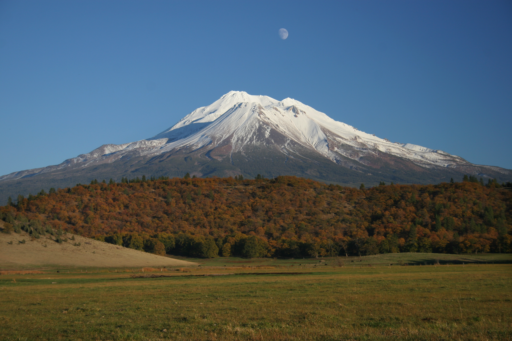
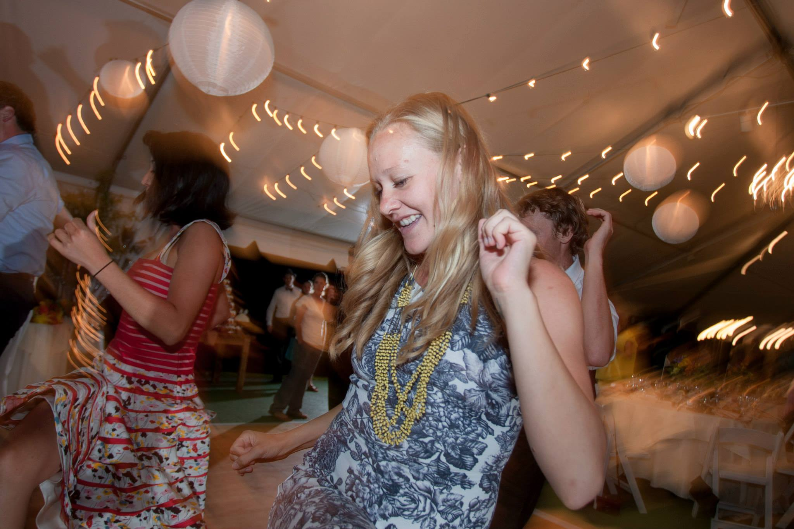
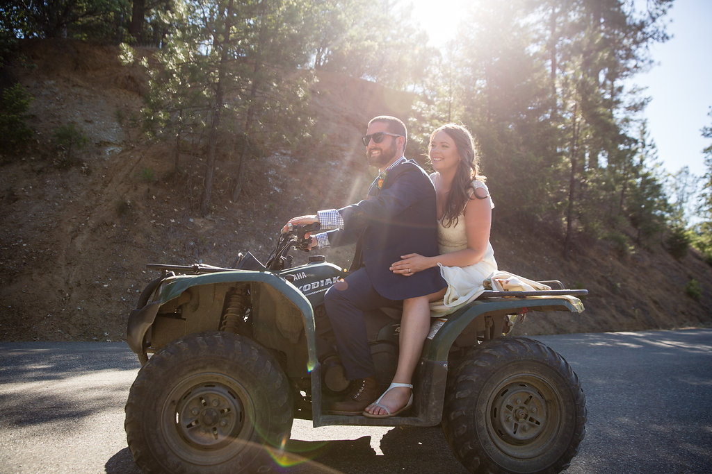

Due to fires near the Bar 717 Ranch, <strong>we have changed the location of our celebration to Mount Shasta, California.
The dates have not changed.</strong>
Please read this site carefully for details.

Kelly Brady and Pete Gadomski are celebrating their marriage on September 12th, 2015.
The celebration will be in [Mount Shasta, California](https://goo.gl/maps/uvJJO).
We hope that you'll join us for a weekend of fun and community!

We can't wait to see you in September!

  
  

    
Mount Shasta, a fourteen-thousand foot mountain near the town of Mount Shasta, California.

  

We will be updating this page with more information as it comes available.
Be sure to check here and/or [the updates page](/updates) for the latest information.

# If You Are Attending...

If you haven't emailed us since August 25th, 2015, please email us at <bradygadomski@gmail.com> to confirm that you are aware of the change in location from the Bar 717 to Mount Shasta.
In your email, please include:

- Your plans for lodging
- If you are camping, do you need any camping equipment?
- Any additional guests that you are “responding for”
- Any concerns or questions that you have

We insist upon this so we can be sure that no guests will show up at the Bar 717.
Thank you for understanding and your flexibility.

# The Location

Mount Shasta is located on Interstate 5 about an hour north of Redding, California.
It is a beautiful small town in the shadow of a fourteen-thousand foot mountain.

We want to do our best to help people get to our celebration, so if you are willing to provide a carpool or need a ride, please [email us](mailto:bradygadomski@gmail.com).

## Getting There

If you are looking to fly in from around the country, [Redding](http://www.ci.redding.ca.us/transeng/airports/index.htm) and [Eureka/Arcata](https://plus.google.com/100151413109057686697/about?gl=us&hl=en) are both about two hours from camp.
[Sacramento](http://www.sacramento.aero/smf/) is only about four hours from camp, and [San Francisco](http://www.flysfo.com/) is the closest large airport.
[Portland](http://www.portofportland.com/PDX_Home.aspx) is another option.

If you're looking to rent a car in Redding, CA, unfortunately you usually can't rent a car after 3pm in Redding, which is after the flights get in.
If this is going to cause you problems, contact us and we can help sort something out to make sure you can make it to the celebration!

## Accommodations

Guests have a few options for lodging in Mount Shasta:

- Book a hotel room at one of the following locations:
  - Mt. Shasta Resort: chalets available. http://mountshastaresort.com/ or call:  530-926-3030
  - Siskiyou Lake: maybe some small cabins for Saturday only. Call- 530-926-2618
  - Shasta Mountinn Retreat and Spa: 2 rooms available. Call- 530-926-1810
  - Strawberry Valley Inn: 7 rooms available- will give a 10% discount to anyone who says they are with the Brady/Gadomski reception group. Call:  530-926-2052 or email at: info@strawberryvalleyinn.com
  - Best Western Plus Tree House:  hotel rooms and suites. Call: 530-926-3101 or 800-780-7234 or http://book.bestwestern.com/bestwestern/US/CA/Mount-Shasta-hotels/BEST-WESTERN-PLUS-Tree-House/Hotel-Overview.do?p
  - Swiss Holiday Lodge: hotel rooms. Call: 530-926-3446
  - More options at:  http://visitmtshasta.com/lodging/
- Camp! We have reserved group campground G1 at Lake Siskiyou for those who would like to camp. Charge is $5 per person plus $5 per car, payable weekend of the celebration.

# The Schedule

- Friday, September 11th
    - **All day**: guests arrive
    - **6pm**: dinner at the Mount Shasta Dance Hall, all guests invited
    - **8pm - late**: open mic night, campfire, etc at the group campsite
- Saturday, September 12th
    - **3:30pm - 6pm**: cocktail hour and lawn games leading up to a ceremony at City Park
    - **6pm - late**: ceremony, dinner, party, etc, at Mount Shasta Dance Hall
- Sunday, September 13th
    - **8am(ish) - 10am(ish)**: pancake breakfast at Lake Siskiyou Camp group camp site

  
  

    
And yes, there will be dancing.

  

## Important Addresses

- The Mount Shasta Dance Hall and the Mount Shasta City Park: [1315 Nixon Road, Mount Shasta, CA](https://www.google.com/maps/place/Mount+Shasta+City+Park/@41.3272804,-122.3242796,16.61z/data=!4m7!1m4!3m3!1s0x54cde0d0e0382e25:0xc6dab33d671ace42!2s1315+Nixon+Rd,+Mt+Shasta,+CA+96067!3b1!3m1!1s0x0000000000000000:0x10fe9b416b3b6b9c)
- Lake Siskiyou Campground: [4239 W. A. Barr Rd, Mount Shasta, CA](https://www.google.com/maps/place/Lake+Siskiyou+Camp-Resort/@41.2731241,-122.342655,14.64z/data=!4m7!1m4!3m3!1s0x54cde5ccea2b8c59:0x1dfeae437da1ea1d!2s4239+W+A+Barr+Rd,+Mt+Shasta,+CA+96067!3b1!3m1!1s0x0000000000000000:0xd159546f62c2f515)

## Ranch Classy

Attire for the ceremony and celebration will be "ranch classy", known by others as "farm fancy."

  
  

    
These guys are doing it right.

  

You know us.
We're not requiring a specific dress code.
Have fun, be comfortable.

# We can't wait!

We are looking forward to seeing all of you in September 2015 for our big party!
